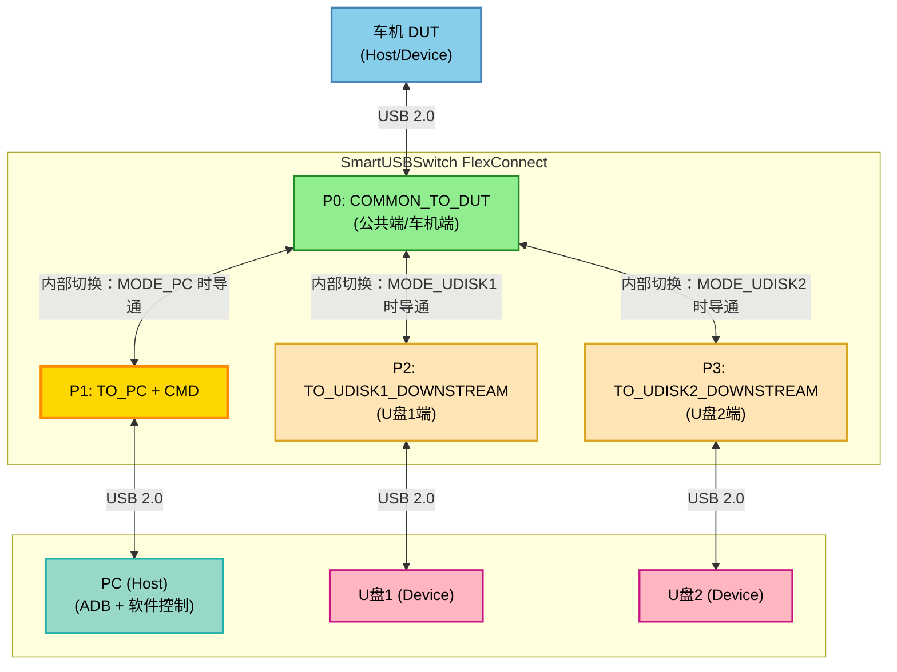
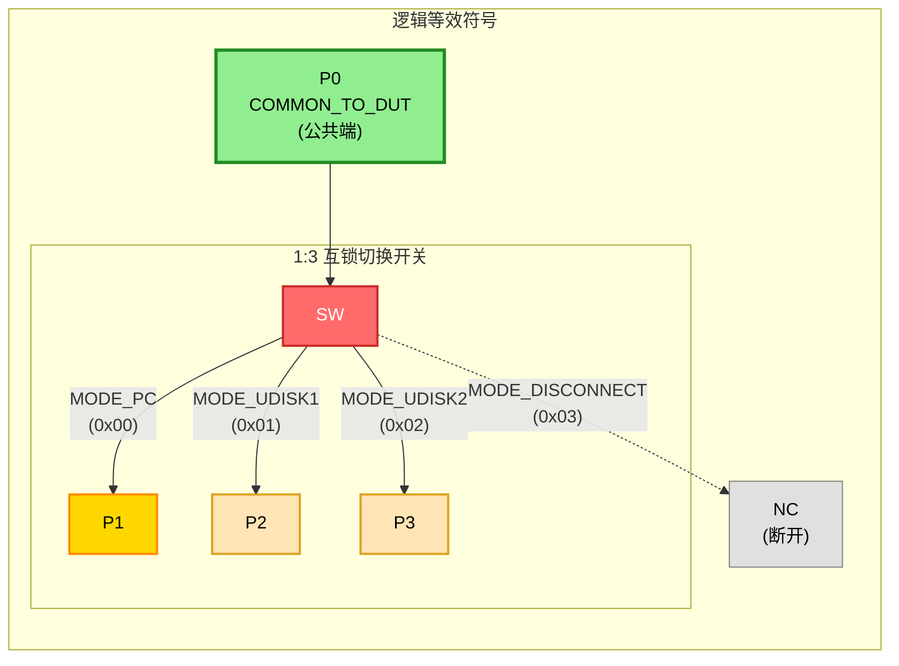
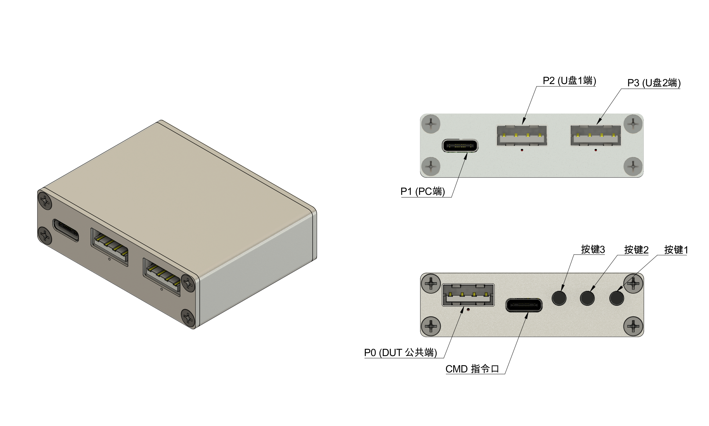

# SmartUSBSwitch FlexConnect 产品规格书

**版本**: v1.0  
**日期**: 2025-01-06  
**产品型号**: SmartUSBSwitch FlexConnect

---

## 目录

- [1. 产品概述](#1-产品概述)
- [2. 应用场景](#2-应用场景)
- [3. 技术规格](#3-技术规格)
- [4. 端口定义](#4-端口定义)
- [5. 工作模式](#5-工作模式)
- [6. 控制方式](#6-控制方式)
- [7. 电气特性](#7-电气特性)
- [8. 安全特性](#8-安全特性)
- [9. 软件接口](#9-软件接口)
- [10. 验收标准](#10-验收标准)
- [11. 产品尺寸与外观](#11-产品尺寸与外观)
- [12. 包装清单](#12-包装清单)
- [13. 质保与售后](#13-质保与售后)
- [14. 订购信息](#14-订购信息)
- [15. 免责说明](#15-免责说明)
  - [15.1 产品认证声明](#151-产品认证声明)
  - [15.2 使用风险与责任](#152-使用风险与责任)
  - [15.3 技术风险与限制](#153-技术风险与限制)
  - [15.4 使用建议](#154-使用建议)
  - [15.5 第三方责任](#155-第三方责任)
  - [15.6 技术支持限制](#156-技术支持限制)
- [16. 修订历史](#16-修订历史)

---

## 1. 产品概述

### 1.1 产品简介

SmartUSBSwitch FlexConnect 是一款智能 USB 切换器，专为车机开发调试场景设计。它能够让车机的单个 USB 端口在"PC调试（ADB）"和"U盘读取"两种模式之间灵活切换，解决了车机 USB 端口资源有限的痛点。

### 1.2 核心功能

- **智能切换**: 自动切换车机 USB 端口在 PC（Host）和 U盘（Device）之间的连接
- **互锁保护**: 确保车机端口同时只连接一路设备，避免总线冲突
- **VBUS 隔离**: 先进的电源隔离设计，防止反向供电和电源冲突
- **多种控制方式**: 支持按键、软件命令控制，方便自动化测试
- **掉电恢复**: 支持断电后自动恢复到上次工作状态
- **状态指示**: LED 指示灯清晰显示当前工作模式

### 1.3 设计特点

- **即插即用**: PC 和 U 盘可同时插在SmartUSBSwitch FlexConnect上，无需频繁插拔
- **安全可靠**: 强制互锁设计，杜绝双路同时连接
- **快速切换**: 模式切换时间 < 200ms，设备识别时间 ≤ 10秒
- **自动化友好**: 提供完整的软件控制接口，支持自动化测试
- **工业级设计**: 过流保护、ESD防护，适应车载环境

---

## 2. 应用场景

### 2.1 主要应用场景

#### 车机开发与调试

开发人员需要频繁在以下两个场景切换：
1. 使用 ADB 调试车机 (PC ←→ 车机)
2. 测试 U 盘功能 / 烧录固件 (U盘 ←→ 车机)
3. 多固件烧录选择 (U盘1 ←→ 车机 / U盘2 ←→ 车机)

传统方式：需要频繁插拔 USB 线
FlexConnect：一键切换，PC 和 U 盘同时连接


#### 自动化测试

测试脚本可以通过软件命令控制切换：
- 自动切换到 ADB 模式，执行命令
- 自动切换到 U 盘模式，验证文件读写
- 无需人工干预，提高测试效率


### 2.2 典型连接拓扑



**端口说明：**

- **P0 (DUT 公共端)**: 连接车机 USB 端口，支持 Host/Device 角色切换

- **P1(PC端 + CMD控制接口)**: USB Type-C 合并口，同时提供：
  - **数据通路**: MODE_PC 时与 P0 导通，用于 ADB 调试（P0 ↔ P1 ↔ PC）
  - **控制接口**: CDC Virtual COM 端口，用于软件控制、配置和状态查询（始终可用，独立于数据切换链路）

- **P2 (U盘1端)**: MODE_UDISK1 时与 P0 导通，车机读取 U 盘1（P0 ↔ P2）

- **P3 (U盘2端)**: MODE_UDISK2 时与 P0 导通，车机读取 U 盘2（P0 ↔ P3，可选）

  

### 2.3 逻辑等效符号

FlexConnect 的逻辑等效符号如下，展示了其核心切换功能：



**逻辑说明：**

- **P0 (公共端)**: 连接车机的公共端口，作为切换的中心节点
- **1:3 互锁切换开关**: 单刀三掷（SP3T）互锁开关，确保 P0 在任意时刻只连接 P1、P2、P3 中的一路
- **P1 (数据+控制)**: 合并端口，MODE_PC 时与 P0 导通（数据通路），同时提供独立的控制接口（始终可用）
- **P2/P3**: U盘1 模式、U盘2 模式的目标端口
- **NC (断开)**: MODE_DISCONNECT 模式下，所有端口断开连接

### 2.4 产品实物图



---

## 3. 技术规格

### 3.1 基本规格

| 规格项 | 参数 |
|--------|------|
| 产品型号 | SmartUSBSwitch FlexConnect |
| USB 标准 | USB 2.0 High-Speed |
| 数据传输速率 | 480 Mbps |
| 端口数量 | 1 个公共端 + 3 个切换端口（PC/CMD合并 + U盘1 + U盘2） |
| 供电方式 | USB 供电 (5V) |
| 端口最大输出电流 | 每个端口 2.1A（VBUS） |
| 工作温度 | -10°C ~ +70°C |
| 存储温度 | -20°C ~ +85°C |
| 工作湿度 | 5% ~ 95% RH (非冷凝) |

### 3.2 接口规格

| 接口 | 类型 | 说明 |
|------|------|------|
| P0: COMMON_TO_DUT | USB Type-A | 连接车机（公共端） |
| P1: TO_PC + CMD | USB Type-C | 连接 PC（ADB 调试 + 软件控制） |
| P2: TO_UDISK1_DOWNSTREAM | USB Type-A | 连接 U 盘1（下行） |
| P3: TO_UDISK2_DOWNSTREAM | USB Type-A | 连接 U 盘2（下行，可选） |

> [!NOTE]
>
> P1 合并接口同时提供数据通路和控制接口，控制接口（CDC Virtual COM）始终可用，独立于数据切换链路。


---

## 4. 端口定义

### 4.1 端口命名与功能

为避免歧义，硬件丝印、文档、软件接口统一采用以下命名：

#### P0: COMMON_TO_DUT (公共端/车机端)
- **功能**: 连接车机 USB 线束（车机物理 USB 口）
- **方向**: 双向数据通道
- **丝印**: `P0` 或 `DUT`

> [!NOTE]
>
> （Host/Device 角色切换由车机/上位机实现，本产品仅负责物理链路切换，不内建角色切换功能）
>
> USB端口规格为 `USB-A`，不支持转接至`USB-C`，请使用USB-A 双公头数据线连接P0和车机。

#### P1: TO_PC_UPSTREAM (PC 端)
- **功能**: 连接上位机 PC（用于 ADB 调试）
- **方向**: PC 作为 Host，车机作为 Device
- **丝印**: `P1` 或 `PC`

#### P2: TO_UDISK1_DOWNSTREAM (U 盘1端)
- **功能**: 连接 U 盘1 母座或延长口
- **方向**: 车机作为 Host，U 盘1 作为 Device
- **丝印**: `P2` 或 `UDISK1`

#### P3: TO_UDISK2_DOWNSTREAM (U 盘2端，可选)
- **功能**: 连接 U 盘2 母座或延长口（如硬件提供第二个 U 盘口）
- **方向**: 车机作为 Host，U 盘2 作为 Device
- **丝印**: `P3` 或 `UDISK2`

#### P4: CMD 控制接口
- **功能**: USB CDC Virtual COM 端口，用于软件控制、配置和状态查询
- **方向**: 双向通信（PC 作为 Host，设备作为 Device）
- **接口类型**: USB CDC (Virtual COM Port)
- **用途**: 
  - 发送控制命令（模式切换、配置等）
  - 查询设备状态（当前模式、故障状态等）
  - 固件更新（如支持）
- **特点**: 独立于数据切换链路（P0-P3），始终连接，不受工作模式影响
- **丝印**: `P4` 或 `CMD` 或 `CTRL`

### 4.2 端口状态图

```
MODE_PC (0x00) - ADB 调试模式:
  P0 ←─────→ P1 (导通，车机 ↔ PC)
  P0 ╳       P2 (断开，电气隔离)
  P0 ╳       P3 (断开，电气隔离)

MODE_UDISK1 (0x01) - U 盘1 模式:
  P0 ╳       P1 (断开，电气隔离)
  P0 ←─────→ P2 (导通，车机 ↔ U盘1)
  P0 ╳       P3 (断开，电气隔离)

MODE_UDISK2 (0x02) - U 盘2 模式:
  P0 ╳       P1 (断开，电气隔离)
  P0 ╳       P2 (断开，电气隔离)
  P0 ←─────→ P3 (导通，车机 ↔ U盘2)

MODE_DISCONNECT (0x03) - 断开模式:
  P0 ╳       P1 (断开)
  P0 ╳       P2 (断开)
  P0 ╳       P3 (断开)
```

---

## 5. 工作模式

### 5.1 模式定义

FlexConnect 支持 4 种工作模式：

#### MODE_PC (0x00) - PC 调试模式
- **连接**: P0 ↔ P1 导通，P2/P3 断开
- **用途**: ADB 调试、车机作为 USB Device
- **LED指示**: 指示灯1亮（白色）

#### MODE_UDISK1 (0x01) - U 盘1 模式
- **连接**: P0 ↔ P2 导通，P1/P3 断开
- **用途**: 车机读取 U 盘1、车机作为 USB Host
- **LED指示**: 指示灯2亮（白色）

#### MODE_UDISK2 (0x02) - U 盘2 模式
- **连接**: P0 ↔ P3 导通，P1/P2 断开
- **用途**: 车机读取 U 盘2、车机作为 USB Host
- **LED指示**: 指示灯3亮（白色）

#### MODE_DISCONNECT (0x03) - 断开模式
- **连接**: 所有端口断开
- **用途**: 隔离所有连接，故障排查
- **LED指示**: 所有指示灯灭

### 5.2 互锁设计与行为

**强制互锁（由设备内部逻辑实现）**:  
P0 在任意时刻**最多只会**连接 P1、P2、P3 中的**一个端口**，其余端口由硬件/固件自动断开，用户无需额外控制。

- **不会出现**: P0 同时连接多个端口的情况
- **不会出现**: 切换瞬间“短时双连”（避免总线冲突）
- **设备行为**: 在模式切换时，先断开当前通路，再导通目标通路，内部保证有明确的断开窗口（200ms），上位机和用户无需干预时序细节

> **说明**: 互锁策略在出厂固件中已实现，用户通过 API 或按键切换模式时，设备自动保证总线安全，不需要上位机额外配合。

---

### 5.3 模式真值表（数据与供电矩阵）

下表总结了各模式下的数据通路、供电路径和指示灯状态，便于一眼看清系统行为。

| 模式 | P0↔P1 (车机↔PC) | P0↔P2 (车机↔U盘1) | P0↔P3 (车机↔U盘2) | 车机 USB 角色 | VBUS 供电方向 | U盘1 供电 | U盘2 供电 | LED1 | LED2 | LED3 |
|------|------------------|-------------------|-------------------|---------------|---------------|-----------|-----------|------|------|------|
| MODE_PC (0x00)      | 导通              | 断开              | 断开              | Device        | PC → 车机  | 关闭      | 关闭      | 亮   | 灭   | 灭   |
| MODE_UDISK1 (0x01)  | 断开              | 导通              | 断开              | Host          | 车机 → U盘1 | 打开      | 关闭      | 灭   | 亮   | 灭   |
| MODE_UDISK2 (0x02)  | 断开              | 断开              | 导通              | Host          | 车机 → U盘2 | 关闭      | 打开      | 灭   | 灭   | 亮   |
| MODE_DISCONNECT(0x03) | 断开            | 断开              | 断开              | 不参与总线    | 无         | 关闭      | 关闭      | 灭   | 灭   | 灭   |

> 注：表中“导通/断开”同时指数据线与 VBUS 的电气状态；互锁和供电切换均由设备内部自动完成。

---

## 6. 控制方式

### 6.1 按键控制

FlexConnect 提供 3 个物理按键：

| 按键 | 短按功能 | 长按功能  |
|------|---------|----------------|
| 按键1 | 切换到 MODE_PC | 恢复出厂设置(6秒)；按住上电：进入bootloader |
| 按键2 | 切换到 MODE_UDISK1 | 启用掉电恢复(3秒) |
| 按键3 | 切换到 MODE_UDISK2 |                  |

**按键控制可禁用**: 通过软件命令可以禁用按键功能，防止误操作。

### 6.2 软件控制

通过 USB CDC Virtual COM 接口控制，支持以下命令：

#### 模式控制命令
- `CMD_SET_FLEXCONNECT_MODE` - 设置当前工作模式
- `CMD_GET_FLEXCONNECT_MODE` - 获取当前工作模式
- `CMD_GET_FLEXCONNECT_FAULT` - 获取故障状态

#### 配置命令
- `CMD_SET_FLEXCONNECT_DEFAULT_MODE` - 设置上电默认模式
- `CMD_GET_FLEXCONNECT_DEFAULT_MODE` - 获取上电默认模式
- `CMD_SET_AUTO_RESTORE` - 启用/禁用掉电恢复
- `CMD_GET_AUTO_RESTORE_STATUS` - 获取掉电恢复状态

#### 按键控制命令
- `CMD_SET_BUTTON_CONTROL` - 启用/禁用按键
- `CMD_GET_BUTTON_CONTROL_STATUS` - 获取按键使能状态

#### 系统命令
- `CMD_SET_DEVICE_ADDRESS` - 设置设备地址
- `CMD_GET_DEVICE_ADDRESS` - 获取设备地址
- `CMD_FACTORY_RESET` - 恢复出厂设置
- `CMD_REBOOT_MCU` - 重启设备
- `CMD_GET_PRODUCT_TYPE` - 获取产品类型
- `CMD_GET_FIRMWARE_VERSION` - 获取固件版本
- `CMD_GET_HARDWARE_VERSION` - 获取硬件版本

### 6.3 上电默认模式

设备支持配置上电默认模式，断电重启后自动进入指定模式：

- **默认**: MODE_PC (0x00)
- **可配置**: MODE_PC / MODE_UDISK1 / MODE_UDISK2
- **持久化**: 保存到 Flash，断电不丢失

### 6.4 掉电恢复功能

掉电恢复功能可以记住最后一次的工作模式：

- **启用后**: 断电重启自动恢复到上次的模式
- **禁用后**: 断电重启使用上电默认模式
- **优先级**: 掉电恢复 > 上电默认模式

**掉电恢复优先级逻辑**:

```
1. 默认电源标志 (channel_default_power_flag)  ← 最高优先级
2. 掉电恢复 (auto_restore + last_mode)        ← 中等优先级
3. 上电默认模式 (default_mode)                ← 最低优先级
```

> [!NOTE]
>
> 该功能默认不开启


---

## 7. 电气特性

### 7.1 VBUS 供电与隔离

#### MODE_PC 供电逻辑
- **P0 (车机)** 与 **P1 (PC)** 形成标准 USB Device 架构
- PC 侧提供 VBUS（5V）给车机
- P2（U 盘1端）和 P3（U 盘2端）完全断开，不被 PC 供电

#### MODE_UDISK1 / MODE_UDISK2 供电逻辑
- **P0 (车机)** 作为 Host，为 U 盘提供 VBUS（5V）
- MODE_UDISK1 时：P0 ↔ P2 导通，只给 U 盘1 供电，P3 断开
- MODE_UDISK2 时：P0 ↔ P3 导通，只给 U 盘2 供电，P2 断开
- P1（PC）完全断开，不被车机供电
- 防反灌设计，避免车机与 PC 供电冲突，也避免 U 盘1/U 盘2 之间供电串扰

#### 隔离方案
- **技术**: 具有反向阻断功能的USB 电源开关
- **保护**: 防反灌、防反向供电
- **切换**: 断开时拉低/断开 VBUS，无双路供电冲突

### 7.2 供电规格

| 参数 | 值 |
|------|---|
| VBUS 电压 | 5V ± 5% |
| 最大输出电流 | 2.1A (各端口) |
| 过流保护阈值 | 2.5A |
| 输入电压范围 | 4.5V ~ 5.5V |

### 7.3 USB 电源开关特性

#### 7.3.1 导通电阻 (rDS(on))

| 条件 | 典型值 | 最大值 | 单位 |
|------|--------|--------|------|
| TJ = 25°C | 70 | 80-92 | mΩ |
| -40°C ≤ TJ ≤ 125°C | - | 110-122 | mΩ |

#### 7.3.2 开关时间

| 参数 | 条件 | 典型值 | 最大值 | 单位 |
|------|------|--------|--------|------|
| 上升时间 (tr) | VIN = 5.5V, CL = 1µF, RL = 100Ω | 0.55 | 0.95 | ms |
| 下降时间 (tf)   | VIN = 5.5V, CL = 1µF, RL = 100Ω | 0.24   | 0.30   | ms   |
| 开启时间 (ton)  | CL = 1µF, RL = 100Ω             | 3.0    | -      | ms   |
| 关闭时间 (toff) | CL = 1µF, RL = 100Ω             | 0.7    | -      | ms   |

### 7.4 数据通道

#### 7.4.1 基本参数

| 参数 | 值 |
|------|---|
| USB 版本 | USB 2.0 |
| 数据速率 | High-Speed 480Mbps |
| 信号完整性 | D+/D- 走线满足 USB 2.0 规范 |
| 切换断开窗口 | 200ms |

> **注**：切换断开窗口包括电源开关的物理断开时间（约0.7ms）和系统保证的安全间隔时间。

#### 7.4.2 USB 数据开关动态特性

**测试条件**: RL = 50Ω, TA = -40°C to 85°C

| 参数 | 测试条件 | 典型值 | 单位 |
|------|----------|--------|------|
| 串扰 (XTALK) | f = 240MHz | -32 | dB |
| 关断隔离 (OISO) | f = 240MHz | -32 | dB |
| 带宽 (-3dB) | RL = 50Ω | 1400 | MHz |

#### 7.4.3 USB 数据开关切换特性

**测试条件**: RL = 50Ω, CL = 5pF, TA = -40°C to 85°C

| 参数 | 测试条件 | 典型值 | 最大值 | 单位 |
|------|----------|--------|--------|------|
| 传播延迟 (tpd) | 480Mbps | 0.25 | - | ns |
| 线路使能时间 (ton) | SEL到D/nD | - | 30 | ns |
| 线路禁用时间 (tOFF) | SEL到D/nD | - | 25 | ns |
| 线路使能时间 (ton) | OE到D/nD | - | 30 | ns |
| 线路禁用时间 (tOFF) | OE到D/nD | - | 25 | ns |
| 输出偏斜 (tsk(O)) | 中心端口到其他端口 | - | 50 | ps |
| 转换偏斜 (tsK(P)) | 同一输出相反转换 | - | 20 | ps |
| 总抖动 (tj) | 480Mbps, PRBS = 2^15 - 1 | - | 20 | ps |

> **注**：
> - 传播延迟主要由开关导通电阻和负载电容的RC延迟决定，典型时间常数为0.25ns（10pF负载）
> - 由于时间常数远小于典型驱动信号的上升/下降时间，总线开关对系统的传播延迟影响很小
> - 系统级传播延迟主要由驱动电路和负载的相互作用决定

---

## 8. 安全特性

### 8.1 过流保护

- **保护阈值**: 2.5A
- **短路响应时间**: 典型值 1.5 µs (VIN = 5V)
- **保护方式**: 以保护阈值恒流
- **恢复方式**: 故障排除后自动恢复

### 8.2 ESD 防护

- **防护等级**: IEC 61000-4-2 Level 4
- **接触放电**: ±8kV
- **空气放电**: ±15kV
- **保护芯片**: 所有 USB 端口、按键均配备 ESD 保护二极管

### 8.3 反向供电保护

- **P1 → P2/P3**: USB 电源开关反向阻断，PC 供电不会进入 U 盘链路
- **P2/P3 → P1**: 防止车机供电进入 PC 链路
- **车机保护**: 防止 PC 与车机同时对 VBUS 供电造成冲突
- **U盘间隔离**: 防止 U 盘1 和 U 盘2 之间供电串扰

### 8.4 故障检测

设备实时监测以下故障：

| 故障位 | 说明 |
|--------|------|
| Bit 0: DUT_VBUS_FAULT | 车机端 VBUS 故障 |
| Bit 1: UDISK1_VBUS_FAULT | U盘1端 VBUS 故障 |
| Bit 2: UDISK2_VBUS_FAULT | U盘2端 VBUS 故障 |

**故障状态查询**: 通过 `CMD_GET_FLEXCONNECT_FAULT` 命令获取

---

## 9. 软件接口

### 9.1 通信协议

- **接口类型**: USB CDC (Virtual COM Port)
- **波特率**: 自动协商（CDC 无需配置波特率）
- **数据格式**: 8N1（8位数据，无校验，1位停止位）
- **协议格式**: 自定义二进制协议

### 9.2 协议格式

```
发送格式: [0x55] [0x5A] [CMD] [CH] [VALUE] [CHECKSUM]
响应格式: [0x55] [0x5A] [CMD] [CH] [VALUE] [CHECKSUM]
         
CHECKSUM = CMD + CH + VALUE (8位和校验)
```

### 9.3 命令列表

#### FlexConnect 专用命令

| 命令码 | 命令名 | 功能 | 参数 |
|--------|--------|------|------|
| 0x20 | CMD_SET_FLEXCONNECT_MODE | 设置工作模式 | mode (0x00~0x03) |
| 0x21 | CMD_GET_FLEXCONNECT_MODE | 获取当前模式 | 无 |
| 0x22 | CMD_GET_FLEXCONNECT_FAULT | 获取故障状态 | 无 |
| 0x24 | CMD_SET_FLEXCONNECT_DEFAULT_MODE | 设置上电默认模式 | mode (0x00~0x02) |
| 0x25 | CMD_GET_FLEXCONNECT_DEFAULT_MODE | 获取上电默认模式 | 无 |

#### 公共命令

| 命令码 | 命令名 | 功能 | 参数 |
|--------|--------|------|------|
| 0x09 | CMD_SET_BUTTON_CONTROL | 启用/禁用按键 | enable (0x00/0x01) |
| 0x0A | CMD_GET_BUTTON_CONTROL_STATUS | 获取按键状态 | 无 |
| 0x0F | CMD_SET_AUTO_RESTORE | 启用/禁用掉电恢复 | enable (0x00/0x01) |
| 0x10 | CMD_GET_AUTO_RESTORE_STATUS | 获取掉电恢复状态 | 无 |
| 0x11 | CMD_SET_DEVICE_ADDRESS | 设置设备地址 | address (0x0000~0xFFFF, MSB+LSB) |
| 0x12 | CMD_GET_DEVICE_ADDRESS | 获取设备地址 | 无 |
| 0xF7 | CMD_REBOOT_MCU | 重启设备 | 无 |
| 0xFC | CMD_FACTORY_RESET | 恢复出厂设置 | 无 |
| 0xF0 | CMD_GET_PRODUCT_TYPE | 获取产品类型 | 无 |
| 0xFD | CMD_GET_FIRMWARE_VERSION | 获取固件版本 | 无 |
| 0xFE | CMD_GET_HARDWARE_VERSION | 获取硬件版本 | 无 |

### 9.4 Python SDK

提供完整的 Python SDK：[mixedsignal-labs/smartusbhub](https://github.com/mixedsignal-labs/smartusbhub/tree/develop)

[例程](https://github.com/mixedsignal-labs/smartusbhub/tree/develop/examples/FlexConnect)

[协议文档](https://github.com/mixedsignal-labs/smartusbhub/blob/main/docs/智能USB集线器_使用指南.md)

```python
from smartusbhub import SmartUSBHub, FLEXCONNECT_MODE_PC, FLEXCONNECT_MODE_UDISK1

# 连接设备
hub = SmartUSBHub.scan_and_connect()

# 切换模式
hub.set_flexconnect_mode(FLEXCONNECT_MODE_PC)

# 获取当前模式
mode = hub.get_flexconnect_mode()

# 设置上电默认模式
hub.set_flexconnect_default_mode(FLEXCONNECT_MODE_UDISK1)

# 启用掉电恢复
hub.set_auto_restore(True)

# 设置设备地址（用于多设备场景）
hub.set_device_address(0x0001)

# 获取设备地址
address = hub.get_device_address()
```

### 10.4 性能参数

| 测试项 | 标准 |
|--------|------|
| 模式切换时间 | < 200ms |
| ADB 恢复时间 | ≤ 10 秒 |
| U 盘挂载时间 | ≤ 10 秒 |
| 切换成功率 | 100% (100,000 次测试) |
| 连续切换次数 | ≥ 100,000 次无故障 |
| MTBF | ≥ 50,000 小时 |

## 11. 产品尺寸与外观

### 11.1 外观设计

- **外壳材质**: 铝合金
- **表面处理**: 阳极氧化喷砂
- **颜色**:银色
- **重量**: 约 50g

### 11.2 指示灯定义

| 指示灯 | 颜色 | 状态说明 |
|--------|------|---------|
| LED1 | 白色 | MODE_PC |
| LED2 | 白色 | MODE_UDISK1 |
| LED3 | 白色 | MODE_UDISK2 |
| LED0 | 白色 | 设备通讯时闪烁 |

### 11.3 尺寸参数

- **长度**: 56mm
- **宽度**: 43mm
- **高度**: 16mm

---

## 12. 包装清单

标准包装包含：

- SmartUSBSwitch FlexConnect 主机 × 1
- 快速入门指南 × 1
- 合格证 × 1
- 保修卡 × 1

可选项：

- USB 数据线（Type-A to Type-C）× 2
- USB 数据线 （Type-A to Type-A）× 1

---

## 13. 质保与售后

### 13.1 质保政策

- **质保期**: 12 个月（自购买之日起）
- **质保范围**: 非人为损坏的硬件故障
- **质保方式**: 免费维修或更换

### 13.2 不在质保范围

- 人为损坏、进水、摔落
- 私自拆卸、改装
- 使用不当导致的损坏
- 自然磨损


### 13.3 技术支持

- **文档**: 提供完整的技术文档和 API 文档
- **示例代码**: 提供 Python示例代码
- **邮件支持**: makerlabtools@outlook.com
- **更新**: 固件可通过 USB 更新

---

## 14. 订购信息

### 14.1 产品型号

| 型号 | 说明 | 端口配置 |
|------|------|---------|
| FlexConnect-3CH | 双U盘版 | 1 公共端 + 1 PC + 2 U盘 |

### 14.2 联系方式

- **官网**: https://github.com/mixedsignal-labs/smartusbhub
- **邮箱**: makerlabtools@outlook.com

---

## 15. 免责说明

### 15.1 产品认证声明

**重要提示**：

本产品 SmartUSBSwitch FlexConnect 虽然按照车规级别的设计标准和可靠性要求进行开发，包括但不限于：

- 工作温度范围：-10°C ~ +70°C
- 工业级元器件选型
- ESD 防护设计（IEC 61000-4-2 Level 4）
- 过流保护和安全隔离设计
- 长期可靠性测试

> [!WARNING]
>
> **本产品未通过任何车规级别认证**（如 AEC-Q100、IATF 16949 等），**不具备车规级别认证资质**。

### 15.2 使用风险与责任

1. **用户自行评估风险**：用户在使用本产品前，应充分了解产品的技术规格、使用限制和潜在风险，并根据实际应用场景自行评估是否适合使用。

2. **不承担任何责任**：制造商（makerlabtools）不对因使用本产品而导致的任何直接或间接损失承担责任，包括但不限于：
   - 设备损坏
   - 数据丢失
   - 业务中断
   - 人身伤害
   - 财产损失
   - 其他任何形式的损失

3. **适用场景限制**：
   - 本产品主要适用于**开发、测试、调试**等非关键应用场景
   - 不建议用于**安全关键系统**、**量产车辆**或其他对可靠性要求极高的应用场景
   - 用户应根据实际需求选择合适的应用场景

4. **质保范围**：本产品的质保范围仅限于产品规格书第13章"质保与售后"中明确规定的范围，不包含因使用不当、超出规格使用或用于不适用场景而导致的任何问题。

### 15.3 技术风险与限制

1. **数据传输风险**：
   - 模式切换过程中（约200ms），数据连接会短暂中断
   - 切换时正在进行的文件传输可能中断，导致数据丢失或损坏
   - 建议在切换模式前确保没有正在进行的文件传输或数据操作
2. **设备识别延迟**：
   - 模式切换后，主机设备（PC/车机）需要重新枚举USB设备
   - ADB恢复时间 ≤ 10秒，U盘挂载时间 ≤ 10秒
3. **固件兼容性**：
   - 不同固件版本可能支持的功能不同
   - 建议使用最新固件版本以获得完整功能支持
4. **环境限制**：
   - 工作温度：-10°C ~ +70°C，超出范围可能导致设备异常
   - 工作湿度：5% ~ 95% RH（非冷凝），高湿度环境可能影响设备寿命
5. **电气规格限制**：
   - 最大输出电流：2A（各端口），整机总输出不超过 2.7A
   - 超出电流限制可能导致过流保护触发，设备自动断开
   - 输入电压范围：4.5V ~ 5.5V，超出范围可能损坏设备
6. **软件兼容性**：
   - 本产品需要配合相应的Python SDK或自行对接串口协议
   - 不同操作系统（Windows/Linux/macOS）的驱动和权限要求不同
   - 第三方软件兼容性不在质保范围内

### 15.4 使用建议

- 在关键应用场景中，建议使用通过相应认证的正式产品
- 使用本产品前，建议进行充分的测试和验证
- 避免在模式切换时进行数据传输操作
- 严格按照产品规格使用，不要超出额定参数
- 如有疑问，请联系技术支持获取更多信息

### 15.5 第三方责任

1. **数据安全与隐私**：
   - 本产品仅负责USB物理链路切换，不涉及数据内容处理
   - 制造商不对通过本产品传输的数据的安全性、完整性或隐私性承担责任
   - 用户需自行采取适当的数据安全措施

### 15.6 技术支持限制

1. **支持范围**：
   - 技术支持主要针对产品本身的功能和使用问题
   - 不包含对用户应用场景、系统集成或第三方软件的深度支持
   - 不保证解决所有技术问题或满足所有用户需求

2. **响应时间**：
   - 技术支持响应时间取决于问题复杂度和支持团队工作负荷
   - 不保证在特定时间内响应或解决问题

---

## 16. 修订历史

| 版本 | 日期 | 修订内容 | 作者 |
|------|------|---------|------|
| v1.0 | 2026-01-06 | 初版发布 | Makerlabtools |

---

**© 2026 makerlabtools. All Rights Reserved.**

